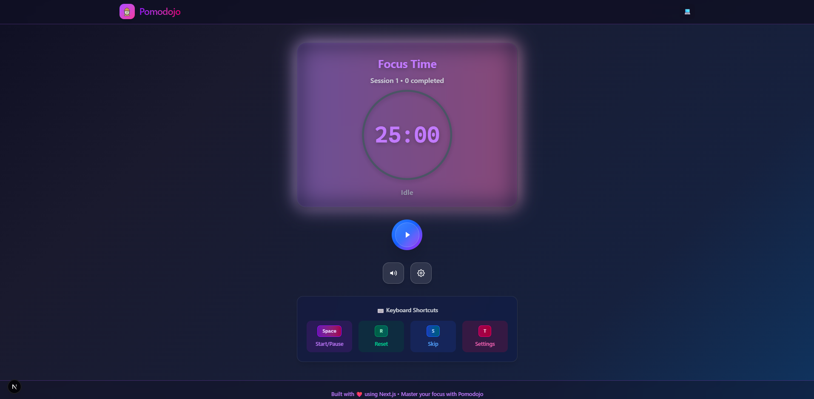

# Pomodojo

A modern, feature-rich Pomodoro timer built with Next.js 15, TypeScript, and Tailwind CSS. Master your focus with a beautiful, intuitive interface designed for productivity enthusiasts.



## Features

- **⏱️ Customizable Timer**: Set your own focus time, short break, and long break durations
- **🎨 Modern UI**: Beautiful glassmorphism design with smooth animations
- **🌙 Dark/Light Theme**: Automatic system preference detection with manual toggle
- **⌨️ Keyboard Shortcuts**: Control everything without touching your mouse
- **🔊 Audio Notifications**: Web Audio API-generated sounds for session completion
- **📊 Session Tracking**: Track completed sessions and total focus time
- **📱 Responsive Design**: Works perfectly on desktop, tablet, and mobile
- **🎯 Visual Progress**: Animated circular progress indicator
- **💾 Data Persistence**: Settings and progress saved in localStorage
- **🔔 Browser Notifications**: Native desktop notifications when sessions complete

## Tech Stack

- **Framework**: Next.js 15 with App Router
- **Language**: TypeScript for type safety
- **Styling**: Tailwind CSS v4 with custom design system
- **Icons**: Custom SVG icons and Lucide React
- **Audio**: Web Audio API for notification sounds
- **State Management**: React hooks with custom state management
- **Build Tool**: Turbopack for fast development

## Getting Started

### Prerequisites

- Node.js 18+ 
- npm, yarn, or pnpm

### Installation

1. Clone the repository:
```bash
git clone https://github.com/arr-code/pomodojo.git
cd pomodojo
```

2. Install dependencies:
```bash
npm install
# or
yarn install
# or
pnpm install
```

3. Start the development server:
```bash
npm run dev
# or
yarn dev
# or
pnpm dev
```

4. Open [http://localhost:3000](http://localhost:3000) in your browser.

## Keyboard Shortcuts

| Key | Action |
|-----|--------|
| `Space` | Start/Pause timer |
| `R` | Reset current session |
| `S` | Skip current session |
| `T` | Open settings |

## Project Structure

```
pomodojo/
├── src/
│   ├── app/                 # Next.js App Router
│   │   ├── globals.css      # Global styles and theme variables
│   │   ├── layout.tsx       # Root layout
│   │   └── page.tsx         # Main application page
│   ├── components/          # React components
│   │   ├── ui/              # Reusable UI components
│   │   │   ├── Button.tsx
│   │   │   ├── Card.tsx
│   │   │   ├── Input.tsx
│   │   │   └── Modal.tsx
│   │   ├── Timer/           # Timer-specific components
│   │   │   ├── TimerDisplay.tsx
│   │   │   ├── TimerControls.tsx
│   │   │   └── TimerSettings.tsx
│   │   └── Layout/          # Layout components
│   │       └── Header.tsx
│   ├── hooks/               # Custom React hooks
│   │   ├── useTimer.ts      # Main timer logic
│   │   ├── useLocalStorage.ts
│   │   ├── useAudio.ts
│   │   └── useKeyboard.ts
│   ├── types/               # TypeScript type definitions
│   │   └── timer.ts
│   └── lib/                 # Utility functions and constants
│       └── constants.ts
├── public/                  # Static assets
└── package.json
```

## Configuration

The default timer settings are:
- **Focus Time**: 25 minutes
- **Short Break**: 5 minutes  
- **Long Break**: 15 minutes
- **Sessions until Long Break**: 4

These can be customized through the settings modal (press `O` or click the settings icon).

## Customization

### Theme Colors

Edit the CSS variables in `src/app/globals.css` to customize the color scheme:

```css
:root {
  --background: #ffffff;
  --foreground: #171717;
  /* Add your custom colors */
}

:root.dark {
  --background: #0f0f23;
  --foreground: #ededed;
  /* Dark theme colors */
}
```

### Default Settings

Modify the default timer configuration in `src/lib/constants.ts`:

```typescript
export const DEFAULT_TIMER_CONFIG: TimerConfig = {
  focusTime: 25,        // minutes
  shortBreak: 5,        // minutes
  longBreak: 15,        // minutes
  sessionsUntilLongBreak: 4,
};
```

## Building for Production

```bash
npm run build
npm run start
```

## Deployment

### Vercel (Recommended)

1. Push your code to GitHub
2. Connect your repository to [Vercel](https://vercel.com)
3. Deploy automatically on every push

### Manual Deployment

```bash
npm run build
```

Deploy the `.next` folder to your hosting provider.

## Browser Support

- Chrome 90+
- Firefox 88+  
- Safari 14+
- Edge 90+

## Features in Detail

### Timer Logic
- Accurate countdown using `setInterval`
- Automatic session progression (Focus → Break → Focus)
- Long break after configurable number of focus sessions
- Pause/resume functionality

### Audio System
- Web Audio API for notification sounds
- Customizable beep sounds for session completion
- Audio can be muted via settings

### Data Persistence
- Settings saved in localStorage
- Session progress persists across browser sessions
- Theme preference remembered

### Responsive Design
- Mobile-first approach
- Optimized for touch devices
- Scales beautifully from 320px to 4K displays

## Contributing

1. Fork the repository
2. Create a feature branch: `git checkout -b feature-name`
3. Make your changes
4. Add tests if applicable
5. Commit your changes: `git commit -m 'Add feature'`
6. Push to the branch: `git push origin feature-name`
7. Submit a pull request

## License

MIT License - see the [LICENSE](LICENSE) file for details.

## Acknowledgments

- Pomodoro Technique® created by Francesco Cirillo
- Design inspired by modern productivity apps
- Built with the amazing Next.js and React ecosystem

---

**Master your focus with Pomodojo** 

Built with ❤️ using Next.js